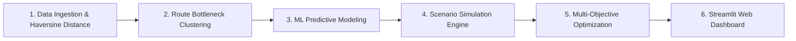

# Factory Reallocation & Shipping Optimization Recommendation System
### Nassau Candy Distributor — Decision Intelligence Platform
**Unified Mentor Machine Learning Internship Project**

---

## IMPORTANT DISCLAIMER & NOTICE OF NON-AFFILIATION

> [!IMPORTANT]
> ### Academic, Educational & Evaluation Purpose Only
> 1. **Academic Internship Project**: This repository, including all accompanying code, documentation, machine learning models, and analytical outputs, was developed solely as an educational project assigned during the **Unified Mentor Machine Learning Internship Program**.
> 2. **No Ownership of Case Study / Brand**: The author (**Biraj2004**) does **NOT** own the intellectual property, trademarks, case study data, or business concepts related to *Nassau Candy Distributor* or *Unified Mentor*. All trademarks, company names, product names, logos, and datasets mentioned belong entirely to their respective owners.
> 3. **Public Repository Notice**: This GitHub repository has been set to **Public** strictly to fulfill the submission requirements of the Unified Mentor project evaluation portal (allowing mentors and evaluators to review and grade the submission).
> 4. **No Commercial Use / Resale**: This repository is non-commercial. No part of this repository may be sold, resold, sublicensed, monetized, or used for commercial gain by any party.
> 5. **Limitation of Liability & Legal Disclaimer**: All code, documentation, simulations, and models in this repository are provided **"AS IS"** for demonstration and educational purposes only, without warranties of any kind, express or implied. The repository author assumes **no responsibility, liability, or legal accountability** for any direct, indirect, incidental, or consequential damages, losses, or legal claims arising from the use, misuse, modification, or distribution of this code or data by third parties.

---

## Project Overview

This project builds an end-to-end **Machine Learning & Optimization Recommendation System** designed to solve static factory assignment bottlenecks for **Nassau Candy Distributor**.

By replacing static legacy allocation rules with data-driven predictive modeling and multi-objective optimization, this system:
* **Predicts** shipping lead times and freight costs across shipping modes and regions.
* **Identifies** high-latency delivery bottlenecks via unsupervised route clustering.
* **Simulates** counterfactual factory reassignment scenarios across 5 production hubs.
* **Recommends** optimal factory-to-product reassignments that minimize lead times while preserving gross margins.
* **Delivers** an interactive **Streamlit Web Application** for operational stakeholders and executive leadership.

---

## Repository Structure

```
UM-Project/
├── docs/                                    # Documentation & Official Specifications
│   ├── Dataset - Nassau Candy Distributor.csv # Historical transactional dataset (10,194 records)
│   ├── PROJECT_INSTRUCTION.md               # Complete project guidelines & specifications
│   └── project-instruction.htm              # Original Unified Mentor instruction snapshot
├── src/                                     # Source code modules (data pipeline, ML, simulation)
├── notebooks/                               # Exploratory data analysis & model experiments
├── app/                                     # Interactive Streamlit Web Application
├── UNDERSTAND_PROJECT.md                    # Master technical guide & architectural blueprint
└── README.md                                # Repository overview & legal disclaimer
```

---

## Core Methodology



1. **Geospatial Feature Engineering**: Haversine distance calculations from 5 US factory hubs (`Lot's O' Nuts`, `Wicked Choccy's`, `Sugar Shack`, `Secret Factory`, `The Other Factory`) to customer destination coordinates.
2. **Unsupervised Route Clustering**: Pinpoint congested shipping corridors using K-Means / DBSCAN.
3. **Predictive Lead Time Modeling**: Benchmark Linear Regression, Random Forest, and Gradient Boosting Regressors evaluated on RMSE, MAE, and R-squared.
4. **Scenario Simulation Engine**: Counterfactual analysis evaluating lead time and margin impact for all product-factory combinations.
5. **Multi-Objective Recommendation Logic**: Pareto ranking balancing delivery speed, gross profit margin, and prediction confidence.
6. **Streamlit Interactive UI**: Real-time decision simulator, what-if matrix, and automated risk alerts.

---

## Key Performance Indicators (KPIs)

* **Lead Time Reduction (%)**: Quantifies operational speed improvement (target: >= 20%).
* **Transit Mileage Saved**: Freight distance eliminated via localized fulfillment.
* **Profit Impact Stability (%)**: Ensures gross margins are preserved (>= 0%).
* **Scenario Confidence Score**: Statistical certainty of machine learning predictions.
* **Recommendation Coverage**: Scalability across all 15 SKUs and 4 US regions.

---

## Detailed Documentation

* **[UNDERSTAND_PROJECT.md](file:///c:/Users/biraj/Desktop/UM-Project/UNDERSTAND_PROJECT.md)** — In-depth architectural blueprint, mathematical formulations, and 4-week internship execution roadmap.
* **[docs/PROJECT_INSTRUCTION.md](file:///c:/Users/biraj/Desktop/UM-Project/docs/PROJECT_INSTRUCTION.md)** — Project problem statement, dataset fields dictionary, and rubric requirements.

---

## License

This project is licensed under the [MIT License](file:///c:/Users/biraj/Desktop/UM-Project/LICENSE) with an Academic & Educational Use Notice. See the `LICENSE` file for full terms, conditions, and limitation of liability disclosures.