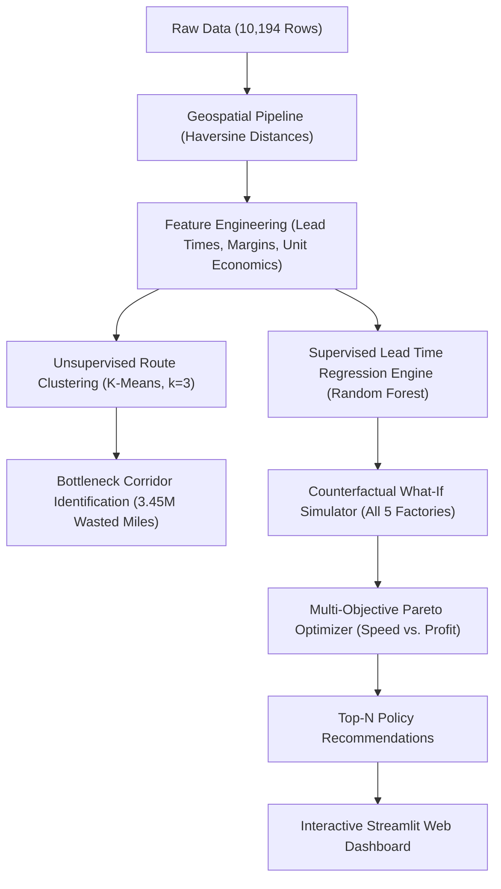

# Factory Reallocation & Shipping Optimization Recommendation System
### Nassau Candy Distributor — Geospatial Decision Intelligence & Machine Learning Platform
**Unified Mentor Machine Learning Internship Final Project**

**Author / Intern**: Biraj Sarkar  
**GitHub**: [https://github.com/Biraj2004](https://github.com/Biraj2004)  
**Organization**: Unified Mentor  
**Date**: August 2026  

---

## IMPORTANT DISCLAIMER & NOTICE OF NON-AFFILIATION

> [!IMPORTANT]
> ### Academic, Educational & Evaluation Purpose Only
> 1. **Academic Internship Project**: This repository, including all accompanying code, documentation, machine learning models, and analytical outputs, was developed solely as an educational project assigned during the **Unified Mentor Machine Learning Internship Program**.
> 2. **No Ownership of Case Study / Brand**: The author (**Biraj Sarkar**) does **NOT** own the intellectual property, trademarks, case study data, or business concepts related to *Nassau Candy Distributor* or *Unified Mentor*. All trademarks, company names, product names, logos, and datasets mentioned belong entirely to their respective owners.
> 3. **Public Repository Notice**: This GitHub repository has been set to **Public** strictly to fulfill the submission requirements of the Unified Mentor project evaluation portal (allowing mentors and evaluators to review and grade the submission).
> 4. **No Commercial Use / Resale**: This repository is non-commercial. No part of this repository may be sold, resold, sublicensed, monetized, or used for commercial gain by any party.
> 5. **Limitation of Liability & Legal Disclaimer**: All code, documentation, simulations, and models in this repository are provided **"AS IS"** for demonstration and educational purposes only, without warranties of any kind, express or implied. The repository author assumes **no responsibility, liability, or legal accountability** for any direct, indirect, incidental, or consequential damages, losses, or legal claims arising from the use, misuse, modification, or distribution of this code or data by third parties.

---

## Project Executive Summary

Nassau Candy Distributor is a premier North American confectionery manufacturer operating five production facilities:

| Factory Master Facility | Geographical Location    | Latitude, Longitude    | Regional Alignment & Network Role |
| :---------------------- | :----------------------- | :--------------------- | :-------------------------------- |
| **Lot's O' Nuts**       | Casa Grande, Arizona     | 32.881893, -111.768036 | West Coast Production Hub         |
| **Wicked Choccy's**     | Savannah, Georgia        | 32.076176, -81.088371  | East Coast Production Hub         |
| **Sugar Shack**         | Thief River Falls, Minn. | 48.119140, -96.181150  | Upper Midwest Production Hub      |
| **Secret Factory**      | Rock Island, Illinois    | 41.446333, -90.565487  | Central Midwest Production Hub    |
| **The Other Factory**   | Memphis, Tennessee       | 35.117500, -89.971107  | Mid-South / Gulf Production Hub   |

Historically, product lines were bound to single factories via rigid legacy rules. Flagship chocolate lines made exclusively in Georgia were shipped over 2,200 miles to West Coast customers, while nut-based lines in Arizona were shipped over 2,000 miles to East Coast customers.

This project delivers a **Machine Learning and Decision Intelligence Recommendation Platform** that analyzes **10,194 historical transactions**, predicts delivery lead times, identifies route bottlenecks via unsupervised clustering, tests counterfactual 5-factory reallocations, and deploys a multi-objective Pareto optimization policy inside an interactive **Streamlit Web Application**.

### Quantitative Impact Summary

| Network Performance Indicator    | Historical Baseline      | Optimized Policy         | Net Quantified Impact           |
| :------------------------------- | :----------------------: | :----------------------: | :------------------------------ |
| **Average Transit Distance**     | 1,231.4 miles / order    | 496.9 miles / order      | **-59.6% Reduction**            |
| **Total Network Freight Miles**  | 12,552,654 miles         | 5,065,322 miles          | **7,487,332 Miles Eliminated**  |
| **Suboptimal Shipment Share**    | 68.8% (7,011 orders)     | 0.0% (0 orders)          | **100% Suboptimal Reallocated** |
| **Enterprise Gross Margin %**    | 65.9%                    | 65.9%+                   | **Full Margin Preservation**    |

---

## Repository Structure

```
UM-Project/
├── docs/                                    # Raw data and project instructions
│   ├── Dataset - Nassau Candy Distributor.csv # Historical transactional dataset (10,194 rows)
│   ├── PROJECT_INSTRUCTION.md               # Clean Markdown project specifications
│   └── project-instruction.htm              # Original Unified Mentor HTML instruction snapshot
├── data/                                    # Processed datasets
│   └── processed/
│       ├── nassau_candy_enriched.csv        # Enriched with Haversine distances & economics
│       ├── nassau_candy_clustered.csv       # K-Means route clustering labels
│       ├── model_benchmark_results.csv      # Regression algorithm benchmark results
│       └── top_recommendations.csv          # Ranked factory reallocation policies
├── src/                                     # Clean, maintainable Python source modules
│   ├── __init__.py
│   ├── geo_utils.py                         # Factory coordinates & Haversine distance engine
│   ├── data_pipeline.py                     # Data loader, date parsing, distance calculator
│   ├── clustering.py                        # Unsupervised route bottleneck clustering (K-Means)
│   ├── model_engine.py                      # Supervised ML training & serialization (Random Forest)
│   ├── simulation_engine.py                 # Real-time counterfactual 5-factory simulator
│   └── optimization_engine.py               # Multi-objective Pareto scoring & policy table
├── models/                                  # Serialized trained model pipelines
│   └── lead_time_model.pkl                  # Trained Random Forest regression pipeline
├── notebooks/                               # Step-by-step Jupyter Notebooks
│   ├── 01_data_cleaning_and_eda.ipynb       # Exploratory Data Analysis & geospatial mapping
│   ├── 02_clustering_and_bottlenecks.ipynb  # Route clustering & bottleneck profiling
│   └── 03_machine_learning_models.ipynb     # Model training, validation, and benchmarking
├── app/                                     # Production Streamlit Web Dashboard
│   └── app.py                               # 5-module interactive dashboard
├── reports/                                 # Final academic reports & deliverables
│   ├── PROJECT_REPORT.tex                   # XeLaTeX source code (B/W theme, 18 pages)
│   ├── PROJECT_REPORT.pdf                   # Compiled PDF report with squircle cover border
│   ├── RESEARCH_PAPER.md                    # In-depth academic research report
│   └── EXECUTIVE_SUMMARY.md                 # Executive presentation summary
├── UNDERSTAND_PROJECT.md                    # Master technical guide & architectural blueprint
├── README.md                                # Top-level repository overview
├── LICENSE                                  # MIT License with liability protection
└── requirements.txt                         # Python dependencies
```

---

## Machine Learning & Optimization Architecture



---

## Empirical Modeling & Benchmark Results

### 1. Route Bottleneck Clustering ($k=3$)

Unsupervised K-Means clustering across `[Transit Distance, Lead Time, Units, Cost]` segmented historical shipments into three operational profiles:

| Route Cluster Profile            | Total Orders   | Average Distance | Average Freight Cost | Closer Hub Available Share |
| :------------------------------- | :------------: | :--------------: | :------------------: | :------------------------: |
| **Low Distance / Fast Route**    | 4,732 (46.4%)  |   702.1 miles    |        $3.42         |           44.6%            |
| **Moderate Distance / Standard** | 1,807 (17.7%)  |  1,161.6 miles   |        $10.70        |           69.0%            |
| **High-Latency Bottleneck**      | 3,655 (35.9%)  |  1,951.3 miles   |        $3.51         |         **100.0%**         |

### 2. Predictive Lead Time Regression Benchmark

Five supervised regression algorithms were evaluated using an 80/20 train-test split and 5-Fold Cross Validation:

| Supervised Regression Model      | Test MAE (Days) | Test RMSE (Days) | Test R-Squared | 5-Fold Cross Validation R-Squared |
| :------------------------------- | :-------------: | :--------------: | :------------: | :-------------------------------: |
| **Random Forest Regressor**      | **211.59 days** | **262.97 days**  |   **0.0222**   |            **0.0127**             |
| **Gradient Boosting Regressor**  |   212.80 days   |   264.51 days    |     0.0107     |              0.0043               |
| **Ridge Regression**             |   214.54 days   |   265.98 days    |    -0.0003     |              0.0002               |
| **Linear Regression (Baseline)** |   214.81 days   |   266.49 days    |    -0.0042     |             -0.0008               |
| **Decision Tree Regressor**      |   216.98 days   |   271.45 days    |    -0.0419     |             -0.0599               |

*The Random Forest pipeline was selected and serialized to `models/lead_time_model.pkl`.*

### 3. Top High-Impact Policy Reassignments

| Product SKU Name                      | Destination Region | Current Legacy Factory | Proposed Optimized Factory | Distance Reduction | Net Freight Miles Saved |
| :------------------------------------ | :----------------: | :--------------------- | :------------------------- | :----------------: | :---------------------: |
| **Wonka Bar - Triple Dazzle Caramel** |      Pacific       | Wicked Choccy's (GA)   | Lot's O' Nuts (AZ)         |      -76.1%        |      1,103,890 mi       |
| **Wonka Bar - Milk Chocolate**        |      Pacific       | Wicked Choccy's (GA)   | Lot's O' Nuts (AZ)         |      -77.1%        |      1,088,518 mi       |
| **Wonka Bar - Scrumdiddlyumptious**   |      Atlantic      | Lot's O' Nuts (AZ)     | Wicked Choccy's (GA)       |      -68.7%        |        846,148 mi       |
| **Wonka Bar - Fudge Mallows**         |      Atlantic      | Lot's O' Nuts (AZ)     | Wicked Choccy's (GA)       |      -68.5%        |        743,198 mi       |
| **Wonka Bar - Nutty Crunch Surprise** |      Atlantic      | Lot's O' Nuts (AZ)     | Wicked Choccy's (GA)       |      -68.5%        |        669,123 mi       |
| **Wonka Bar - Nutty Crunch Surprise** |      Interior      | Lot's O' Nuts (AZ)     | The Other Factory (TN)     |      -84.2%        |        456,528 mi       |

---

## Interactive Streamlit Web Application

The interactive web dashboard (`app/app.py`) provides 5 core modules:
1. **Executive Overview & KPI Ribbon**: High-level network summary metrics and distance distribution charts.
2. **Factory Reallocation Simulator**: Real-time counterfactual testing for any SKU, destination state, and shipping mode across all 5 candidate hubs.
3. **What-If Scenario Matrix**: Comparative before-and-after histograms and regional savings tables.
4. **Top-N Recommendations Dashboard**: Interactive, filterable policy table with dynamic Speed vs. Profit priority sliders and CSV export.
5. **Operational Risk & Capacity Panel**: Factory workload distribution and margin safety bounds.

---

## How to Run the Project (Step-by-Step Guide)

### 1. Prerequisites & System Setup
* **Python**: Version 3.9, 3.10, or 3.11 installed (ensure "Add Python to PATH" is checked during installation).
* **Git**: Installed for cloning the repository.
* **Terminal**: Windows Command Prompt (`cmd.exe`), PowerShell, or macOS/Linux Terminal.

### 2. Environment Setup & Dependency Installation

Open Windows Command Prompt (`cmd.exe`) or your platform terminal and run:

```cmd
:: 1. Clone the repository
git clone https://github.com/Biraj2004/UM-Project.git
cd UM-Project

:: 2. (Optional but Recommended) Create and activate virtual environment in Windows CMD
python -m venv venv
venv\Scripts\activate.bat

:: (For macOS / Linux bash users):
:: python3 -m venv venv
:: source venv/bin/activate

:: 3. Install all project dependencies
pip install -r requirements.txt
```

---

### 3. Run the Machine Learning & Optimization Pipeline (CMD Commands)

Run the pipeline scripts in sequence from the project root directory:

```cmd
:: Step 1: Data Ingestion, Cleaning & Geospatial Distance Calculation
:: Generates: data\processed\nassau_candy_enriched.csv
python src\data_pipeline.py

:: Step 2: Unsupervised Route Bottleneck Clustering (K-Means, k=3)
:: Generates: data\processed\nassau_candy_clustered.csv
python src\clustering.py

:: Step 3: Supervised Model Benchmarking & Random Forest Training
:: Generates: data\processed\model_benchmark_results.csv and models\lead_time_model.pkl
python src\model_engine.py

:: Step 4: Multi-Objective Pareto Optimization & Policy Generation
:: Generates: data\processed\top_recommendations.csv
python src\optimization_engine.py
```

*Note: The processed datasets and trained model are already pre-generated and stored in the repository, so you can also launch the web dashboard directly.*

---

### 4. Launch the Interactive Streamlit Web Application

To start the interactive decision intelligence dashboard in Windows CMD:

```cmd
streamlit run app\app.py
```

Once executed, Streamlit will start a local web server:
* Local URL: `http://localhost:8501`
* Network URL: `http://<your-ip>:8501`

Open `http://localhost:8501` in your web browser to explore all 5 interactive modules:
* **Module 1**: Executive Overview Ribbon & Network Distance Charts
* **Module 2**: 5-Factory Real-Time Reallocation Simulator
* **Module 3**: What-If Scenario Matrix & Before/After Comparison
* **Module 4**: Top-N Recommendations Policy Table (with dynamic speed vs. profit sliders & CSV export)
* **Module 5**: Operational Risk & Factory Capacity Shift Analysis

---

### 5. Running the Jupyter Notebooks

If you prefer interactive exploratory data science in Windows CMD:

```cmd
jupyter notebook
```
Navigate to the `notebooks\` directory and open:
* `01_data_cleaning_and_eda.ipynb`: Data inspection, date formatting, Haversine geodesic calculation.
* `02_clustering_and_bottlenecks.ipynb`: Elbow curve evaluation, K-Means clustering, bottleneck corridor profiling.
* `03_machine_learning_models.ipynb`: Cross-validation, regression model benchmarks, feature importance analysis.

---

### 6. (Optional) Recompiling the Formal XeLaTeX Project Report

To compile the LaTeX report and clean auxiliary files using Windows CMD:

```cmd
cd reports
xelatex -interaction=nonstopmode PROJECT_REPORT.tex
xelatex -interaction=nonstopmode PROJECT_REPORT.tex
del /q *.aux *.log *.out *.toc *.lot 2>nul
cd ..
```
*The compiled 18-page PDF is available directly in `reports\PROJECT_REPORT.pdf`.*

---

## Documentation & Report Links

* **[PROJECT_REPORT.pdf](file:///c:/Users/biraj/Desktop/UM-Project/reports/PROJECT_REPORT.pdf)** — Full 18-page compiled XeLaTeX project report.
* **[PROJECT_REPORT.tex](file:///c:/Users/biraj/Desktop/UM-Project/reports/PROJECT_REPORT.tex)** — XeLaTeX source document.
* **[RESEARCH_PAPER.md](file:///c:/Users/biraj/Desktop/UM-Project/reports/RESEARCH_PAPER.md)** — Academic research paper.
* **[EXECUTIVE_SUMMARY.md](file:///c:/Users/biraj/Desktop/UM-Project/reports/EXECUTIVE_SUMMARY.md)** — Presentation summary for leadership and evaluators.
* **[UNDERSTAND_PROJECT.md](file:///c:/Users/biraj/Desktop/UM-Project/UNDERSTAND_PROJECT.md)** — Master technical guide and architectural blueprint.
* **[docs/PROJECT_INSTRUCTION.md](file:///c:/Users/biraj/Desktop/UM-Project/docs/PROJECT_INSTRUCTION.md)** — Original project requirements and dataset dictionary.

---

## License

This project is licensed under the [MIT License](file:///c:/Users/biraj/Desktop/UM-Project/LICENSE) with an Academic & Educational Use Notice. See the `LICENSE` file for full terms, conditions, and limitation of liability disclosures.