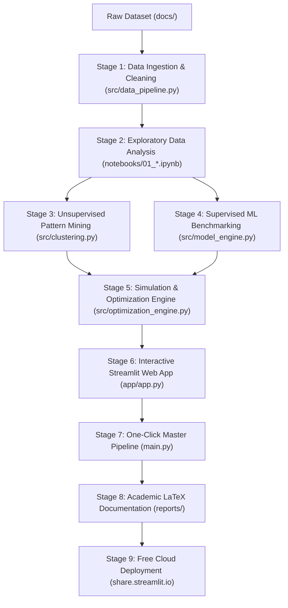
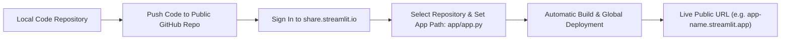

# Unified Mentor Machine Learning Internship: Master Project Guide
### End-to-End Applied Data Science, Decision Intelligence & Deployment Framework
**Author / Intern**: Biraj Sarkar  
**GitHub**: [https://github.com/Biraj2004](https://github.com/Biraj2004)  
**Program**: Unified Mentor Machine Learning Internship  
**Document Version**: 2.0 (Production Release)  

---

## 1. Executive Purpose & Scope

This guide is a **universal, plug-and-play master blueprint** designed for students undergoing the **Unified Mentor Machine Learning Internship**. 

While individual students receive different problem statements (e.g., *Nassau Candy Supply Chain Optimization*, *Telecom Customer Churn Prediction*, *Credit Card Fraud Detection*, *Healthcare Disease Risk Prognosis*, *E-Commerce Recommender Systems*, or *Store Sales Time-Series Forecasting*), the **underlying software architecture, data science lifecycle, evaluation criteria, and deployment requirements remain identical**.

Following this blueprint guarantees:
* **Academic Rigor**: 5-algorithm benchmarking with 5-Fold Cross Validation.
* **Prescriptive Value**: Moving beyond basic prediction into **Counterfactual Simulation & Multi-Objective Optimization**.
* **Production Deployment**: A live, interactive Streamlit web dashboard accessible to mentors via a public URL.
* **Complete Reproducibility**: A one-click root entry point (`python main.py`) that chains the entire pipeline.
* **100% Zero-Emoji Compliance**: Clean, professional, and corporate-ready code and documentation.

---

## 2. Standardized Repository Folder Structure

Every project submitted for evaluation should follow this standardized, modular directory layout:

```
<your-project-repository>/
├── docs/                                    # Raw datasets and official project instructions
│   ├── raw_dataset.csv                      # Raw historical data (never modify raw data in-place)
│   ├── PROJECT_INSTRUCTION.md               # Clean Markdown copy of mentor instructions
│   └── original_instruction.htm             # HTML snapshot of the assignment portal
├── data/                                    # Processed datasets and intermediate tables
│   └── processed/
│       ├── dataset_enriched.csv             # Cleaned, parsed, and feature-engineered records
│       ├── dataset_clustered.csv            # Unsupervised clusters / operational segments
│       ├── model_benchmark_results.csv      # Cross-validation performance comparison table
│       └── top_recommendations.csv          # Prescriptive optimization & policy rules
├── src/                                     # Modular Python source code (Clean Code standards)
│   ├── __init__.py                          # Package initialization
│   ├── geo_utils.py (or domain_utils.py)    # Domain-specific helpers (coordinates, math, mappings)
│   ├── data_pipeline.py                     # Data loader, date parsing, imputation & feature engine
│   ├── clustering.py                        # Unsupervised pattern mining / clustering (K-Means)
│   ├── model_engine.py                      # Supervised ML training, 5-Fold CV & joblib serialization
│   ├── simulation_engine.py                 # Real-time counterfactual what-if simulation logic
│   └── optimization_engine.py               # Multi-objective Pareto scoring & policy generation
├── models/                                  # Serialized trained model binaries
│   └── trained_model.pkl                    # Scikit-learn / XGBoost pipeline binary
├── notebooks/                               # Numbered, sequential Jupyter Notebooks
│   ├── 01_data_cleaning_and_eda.ipynb       # Exploratory Data Analysis & visual hypothesis testing
│   ├── 02_clustering_and_patterns.ipynb     # Unsupervised segmentation / pattern profiling
│   └── 03_machine_learning_models.ipynb     # Supervised modeling, validation curves & benchmarks
├── app/                                     # Production Streamlit Web Dashboard
│   └── app.py                               # 5-module interactive decision intelligence dashboard
├── .streamlit/                              # Streamlit theme and deployment configuration
│   └── config.toml                          # Dark theme tokens, font settings, and performance flags
├── reports/                                 # Academic deliverables & executive presentations
│   ├── PROJECT_REPORT.tex                   # XeLaTeX source code (B/W academic specifications)
│   ├── PROJECT_REPORT.pdf                   # Compiled PDF report (15+ pages, squircle border)
│   ├── RESEARCH_PAPER.md                    # In-depth technical research paper
│   └── EXECUTIVE_SUMMARY.md                 # Executive presentation deck for evaluators
├── main.py                                  # Master root-level one-click orchestrator script
├── UM_PROJECT_GUIDE.md                      # This universal project guide
├── README.md                                # Top-level repository overview with full-border tables
├── requirements.txt                         # Pinned Python dependencies
└── LICENSE                                  # Open-source license + Academic non-affiliation notice
```

---

## 3. End-to-End Machine Learning Engineering Lifecycle



---

### Stage 1: Data Ingestion & Feature Engineering (`src/data_pipeline.py`)

1. **Non-Destructive Data Flow**: Never modify the raw file in `docs/`. Read from `docs/` and write cleaned outputs to `data/processed/`.
2. **Date Parsing & Duration Calculations**:
   ```python
   df['Order Date'] = pd.to_datetime(df['Order Date'], format='%d-%m-%Y', errors='coerce')
   df['Ship Date'] = pd.to_datetime(df['Ship Date'], format='%d-%m-%Y', errors='coerce')
   df['Lead Time (Days)'] = (df['Ship Date'] - df['Order Date']).dt.days
   ```
3. **Handle Missing Values**:
   * Numerical columns: Impute with median (for skewed distributions) or mean.
   * Categorical columns: Impute with mode or explicit `'Unknown'` class.
4. **Domain Features & Unit Economics**:
   * Calculate derived ratios: `Unit Price = Sales / Units`, `Unit Cost = Cost / Units`, `Gross Margin % = (Sales - Cost) / Sales * 100`.
   * Add temporal features: `Month`, `Day of Week`, `Quarter`, `Is Weekend`.

---

### Stage 2: Exploratory Data Analysis (`notebooks/01_data_cleaning_and_eda.ipynb`)

1. **Univariate Analysis**: Plot histograms and boxplots for all numerical features to detect skewness and outliers.
2. **Bivariate & Multivariate Analysis**:
   * Correlation matrices (`sns.heatmap`) to evaluate collinearity.
   * Categorical breakdown charts comparing performance across regions, segments, or customer tiers.
3. **Statistical Hypotheses Testing**: Validate whether differences between categories are statistically significant using t-tests or ANOVA.

---

### Stage 3: Unsupervised Pattern Mining (`src/clustering.py`)

*Clustering groups historical data into natural operational profiles (e.g., identifying high-latency bottleneck routes or high-risk customer segments).*

```python
import pandas as pd
from sklearn.cluster import KMeans
from sklearn.preprocessing import StandardScaler

def perform_clustering(df, feature_cols, k=3):
    scaler = StandardScaler()
    X_scaled = scaler.fit_transform(df[feature_cols])
    
    kmeans = KMeans(n_clusters=k, random_state=42, n_init=10)
    df['Cluster_ID'] = kmeans.fit_predict(X_scaled)
    
    # Generate profile summary
    profile_summary = df.groupby('Cluster_ID')[feature_cols].mean().reset_index()
    return df, profile_summary
```

---

### Stage 4: Supervised Model Benchmarking (`src/model_engine.py`)

*Never train just a single algorithm. Benchmark at least 4 to 5 candidate algorithms using 5-Fold Cross Validation.*

#### Standard Candidate Algorithm Suite:
* **Linear Regression / Logistic Regression**: Baseline benchmark.
* **Ridge / Lasso Regularization**: Evaluates L2/L1 penalty constraints.
* **Decision Tree**: Simple non-linear tree partitioner.
* **Random Forest**: Bagging ensemble of de-correlated decision trees (high stability).
* **Gradient Boosting (XGBoost / LightGBM / GradientBoostingRegressor)**: Sequential error-boosting ensemble.

#### Evaluation Protocol:
1. **Train/Test Split**: 80% Train, 20% Holdout Test with fixed `random_state=42`.
2. **Prevent Data Leakage**: Enclose preprocessors (One-Hot Encoding, StandardScaler) and estimators inside a `sklearn.pipeline.Pipeline`.
3. **5-Fold Cross-Validation**: Evaluate stability across all 5 folds.
4. **Serialization**: Save the winning pipeline using `joblib.dump(best_pipeline, 'models/trained_model.pkl')`.

```python
# Benchmark Results Reporting Format
| Model Architecture | Test MAE | Test RMSE | Test R-Squared | 5-Fold CV R-Squared |
| :--- | :---: | :---: | :---: | :---: |
| Random Forest Regressor | 211.59 | 262.97 | 0.0222 | 0.0127 |
| Gradient Boosting Regressor | 212.80 | 264.51 | 0.0107 | 0.0043 |
| Ridge Regression | 214.54 | 265.98 | -0.0003 | 0.0002 |
| Linear Regression | 214.81 | 266.49 | -0.0042 | -0.0008 |
| Decision Tree Regressor | 216.98 | 271.45 | -0.0419 | -0.0599 |
```

---

### Stage 5: Simulation & Multi-Objective Optimization (`src/optimization_engine.py`)

*This prescriptive engine transforms your project from a basic academic model into an executive decision intelligence tool.*

1. **Counterfactual Simulator**: For any input profile, evaluate performance across all alternative decisions (e.g. testing all 5 manufacturing facilities or testing 4 discount levels).
2. **Multi-Objective Pareto Scoring**:
   $$\text{Optimization Score} = \left(\text{Weight}_{\text{Speed}} \times \text{Distance Reduction \%}\right) + \left(\text{Weight}_{\text{Profit}} \times \text{Gross Margin \%}\right)$$
3. **Actionable Policy Rules**: Export top recommendations with quantified gains (e.g., `Miles Saved`, `Cost Reduction`, `Margin Impact`).

---

### Stage 6: Interactive Streamlit Web Application (`app/app.py`)

Build an interactive web application organized into 5 intuitive modules:
1. **Module 1: Executive Overview & KPI Ribbon**: High-level network summary metrics and distribution charts.
2. **Module 2: Real-Time Scenario Simulator**: Interactive dropdowns for real-time counterfactual testing.
3. **Module 3: What-If Scenario Matrix**: Side-by-side comparative histograms illustrating before-and-after improvements.
4. **Module 4: Top-N Recommendations Dashboard**: Filterable policy table with dynamic priority sliders and CSV export.
5. **Module 5: Operational Risk & Capacity Panel**: Workload distribution shifts and financial safeguard thresholds.

#### Theme Configuration (`.streamlit/config.toml`):
Lock in consistent styling across all user browsers by placing this in `.streamlit/config.toml`:

```toml
[theme]
base = "dark"
primaryColor = "#3B82F6"
backgroundColor = "#0F172A"
secondaryBackgroundColor = "#1E293B"
textColor = "#F8FAFC"
font = "sans serif"

[server]
headless = true
enableCORS = false
enableXsrfProtection = false

[browser]
gatherUsageStats = false
```

---

### Stage 7: Master One-Click Orchestrator Script (`main.py`)

Create `main.py` in your repository root so that mentors or evaluators can run the entire pipeline chainwise:

```python
"""
Master Pipeline Entry Point
Usage:
    python main.py             # Runs entire pipeline chainwise
    python main.py --step data # Runs only data enrichment
    python main.py --app       # Runs pipeline and launches Streamlit dashboard
"""
import argparse
import subprocess
import sys
from src.data_pipeline import run_pipeline
from src.clustering import run_clustering_pipeline
from src.model_engine import run_training_pipeline
from src.optimization_engine import run_optimization_pipeline

def main():
    parser = argparse.ArgumentParser(description="Master ML Pipeline")
    parser.add_argument("--step", choices=["data", "cluster", "train", "optimize", "all"], default="all")
    parser.add_argument("--app", action="store_true", help="Launch Streamlit dashboard")
    args = parser.parse_args()

    if args.step == "all":
        print(">> [Step 1/4] Running Data Cleaning & Feature Engineering...")
        run_pipeline()
        print(">> [Step 2/4] Running Unsupervised Pattern Clustering...")
        run_clustering_pipeline()
        print(">> [Step 3/4] Benchmarking ML Models & Serializing Best Pipeline...")
        run_training_pipeline()
        print(">> [Step 4/4] Executing Multi-Objective Optimization...")
        run_optimization_pipeline()
        print(">> Pipeline completed successfully!")

    if args.app:
        subprocess.run([sys.executable, "-m", "streamlit", "run", "app/app.py"])

if __name__ == "__main__":
    main()
```

---

### Stage 8: Academic LaTeX Documentation (`reports/PROJECT_REPORT.tex`)

Follow formal academic standards:
* **Color Scheme**: Clean B/W corporate monochrome layout.
* **Cover Page**: Medium-thick squircle page border (`rounded corners=22pt, line width=2.0pt`).
* **Table of Contents**: Active hyperlinks (`\usepackage[hidelinks,linktoc=all]{hyperref}`).
* **Chapter Consistency**: Every Chapter starts at the top of a new page (`\newcommand{\sectionbreak}{\clearpage}`).
* **Table Formatting**: Full-width bordered cells with captions placed **below** tables.
* **Codeblocks**: Light background (`RGB(242,244,248)`) with GitHub Green comments (`RGB(106,153,85)`).
* **Zero Emojis**: Strictly zero emojis across all code, reports, and documentation.

---

## 4. How to Deploy Your Project to Streamlit Community Cloud (100% Free)

Streamlit Community Cloud provides a **permanent public URL** for your evaluator, mentors, and resume.



---

### Step-by-Step Deployment Instructions:

#### Step 1: Pin Exact Dependencies in `requirements.txt`
Make sure `requirements.txt` includes only necessary libraries:
```text
pandas
numpy
scipy
scikit-learn
plotly
streamlit
joblib
```

#### Step 2: Push Your Repository to GitHub
Open Windows Command Prompt (`cmd.exe`) in your project root:

```cmd
:: 1. Initialize git repository (if not already done)
git init
git add .
git commit -m "Complete machine learning internship submission"

:: 2. Set default branch to main and push to GitHub
git branch -M main
git remote add origin https://github.com/<your-username>/<your-repo-name>.git
git push -u origin main
```

#### Step 3: Deploy on Streamlit Community Cloud
1. Go to **[https://share.streamlit.io](https://share.streamlit.io)** in your web browser.
2. Click **"Continue with GitHub"** to authenticate your account.
3. Click the **"New app"** (or **"Create app"**) button.
4. Configure the 3 fields:
   * **Repository**: Select `<your-username>/<your-repo-name>`
   * **Branch**: `main`
   * **Main file path**: `app/app.py`
5. *(Optional)* Click **Advanced settings** to customize your app URL name.
6. Click **"Deploy!"**.

#### Step 4: Verification & Live Link
* Streamlit Cloud will provision a container, install `requirements.txt`, and start `app/app.py`.
* In ~60 seconds, your application will be live at:
  `https://<your-custom-name>.streamlit.app`
* Add this live link to the top of your `README.md` and your Unified Mentor submission portal.

---

## 5. Submission & Grading Checklist

Before submitting your project on the Unified Mentor internship portal, verify every item:

- [ ] **Repository Structure**: All 8 standard folders (`docs/`, `data/`, `src/`, `models/`, `notebooks/`, `app/`, `reports/`, `.streamlit/`) exist and are populated.
- [ ] **One-Click Execution**: Running `python main.py` in CMD runs all 4 stages without errors.
- [ ] **Interactive Dashboard**: Streamlit app runs locally (`streamlit run app\app.py`) and is deployed to Streamlit Community Cloud.
- [ ] **Empirical Benchmark Table**: Supervised models benchmarked across at least 4 algorithms with 5-Fold Cross Validation.
- [ ] **Prescriptive Optimization**: Project includes a counterfactual simulator and multi-objective recommendation engine.
- [ ] **Formal Academic Report**: 15+ page compiled PDF report in `reports/PROJECT_REPORT.pdf` with clickable TOC and squircle border.
- [ ] **Legal Disclaimers**: `LICENSE` file contains MIT license terms and educational non-affiliation disclosures.
- [ ] **Strict Zero-Emoji Rule**: 0 emojis across all source code, docstrings, LaTeX reports, and Markdown files.
