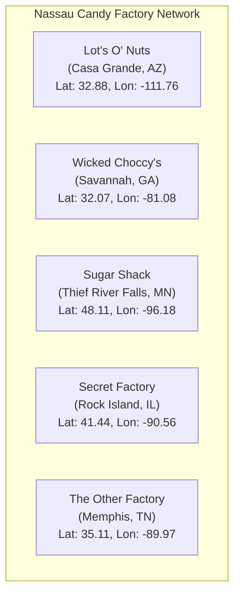
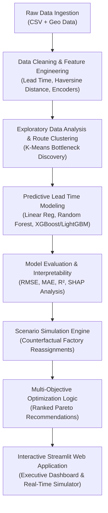
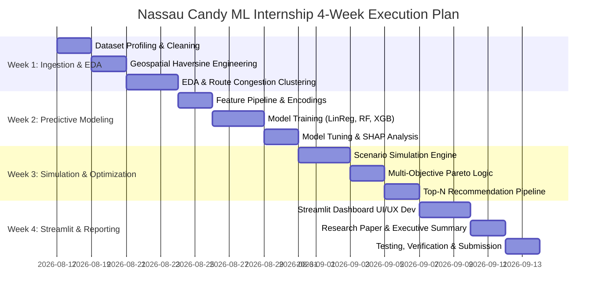

# Nassau Candy Distributor: Factory Reallocation & Shipping Optimization Recommendation System
### Unified Mentor Machine Learning Internship — Comprehensive Project Blueprint & Guide

---

## IMPORTANT DISCLAIMER & NOTICE OF NON-AFFILIATION

> [!IMPORTANT]
> **Academic, Educational & Evaluation Purpose Only:**
> - **Internship Project Only:** This repository, project documentation, machine learning models, and all related artifacts are produced solely for educational and academic completion of the **Unified Mentor Machine Learning Internship Program**.
> - **No Proprietary Ownership:** The author does **NOT** own the *Nassau Candy Distributor* brand, trademarks, case study materials, or data. All intellectual property, trademarks, and problem statements remain the property of their respective owners / Unified Mentor.
> - **Public Repository for Evaluation:** This repository is hosted publicly solely to allow submission, verification, and evaluation by the Unified Mentor grading portal.
> - **No Commercial Rights / Resale Prohibited:** This project is strictly non-commercial. No commercial exploitation, sale, or distribution of this code or dataset is permitted.
> - **Limitation of Liability:** All code, data analysis, and predictive models are provided **"AS IS"** without warranties of any kind. The author assumes **no liability, responsibility, or legal obligations** for any third-party use, reproduction, or reliance on materials found in this repository.

---

## 1. Executive Summary & Project Context

### 1.1 Business Background
**Nassau Candy** is one of North America's premier wholesale candy and confectionery distributors, manufacturing and distributing millions of confectionery units across multiple product lines (Chocolate, Sugar, and Specialty Confections) throughout the United States. 

Currently, Nassau Candy operates five key production and distribution factories across the United States. However, the company relies on **static legacy assignment rules**—meaning each product is statically tied to a single predetermined factory, irrespective of where the ordering customer is located, the destination region's demand surge, or the prevailing shipping mode.

```
+---------------------------------------------------------------------------------------------------------+
|                                    CURRENT STATIC LEGACY SYSTEM (PROBLEM)                               |
|                                                                                                         |
|   [West Coast Customer in California] <====== Orders Wonka Milk Chocolate ======> [Wicked Choccy's (GA)] |
|                                       Transit Distance: ~2,400+ miles                                   |
|                                       High Shipping Lead Time & Margin Erosion                          |
+---------------------------------------------------------------------------------------------------------+
                                                     |
                                                     v
+---------------------------------------------------------------------------------------------------------+
|                              PROPOSED DECISION INTELLIGENCE SYSTEM (SOLUTION)                           |
|                                                                                                         |
|   [West Coast Customer in California] <====== Orders Wonka Milk Chocolate ======> [Lot's O' Nuts (AZ)]   |
|                                       Transit Distance: ~400 miles                                      |
|                                       - 70%+ Distance Reduction                                         |
|                                       - Reduced Lead Time & Freight Cost                                |
|                                       - Maintained/Maximized Profitability Margin                       |
+---------------------------------------------------------------------------------------------------------+
```

### 1.2 Core Problem Statement
The legacy fulfillment process causes severe operational vulnerabilities:
1. **Suboptimal Transit Distances**: Products manufactured on the East Coast are shipped across the continent to West Coast customers and vice-versa, causing unnecessary freight mileage.
2. **Prolonged Lead Times**: Severe delivery bottlenecks in high-volume regions (*Pacific, Atlantic, Interior, Gulf*).
3. **Margin Erosion**: Rising logistics and expediting costs degrade gross profit margins.
4. **Absence of Scenario Simulation**: Leadership currently has no data-driven system to simulate *"What if we reallocate Product X to Factory Y?"* before committing capital or operational changes.

### 1.3 Project Objective
To design, develop, and deploy an end-to-end **Machine Learning & Optimization Recommendation System** that:
- **Predicts** shipping lead times and costs under diverse operating parameters.
- **Clusters & Pinpoints** congested shipping routes and regional bottlenecks.
- **Simulates** counterfactual factory-product reallocation scenarios.
- **Recommends** optimal factory assignments that minimize lead times and freight costs while preserving gross profit.
- **Deploys** a production-grade, interactive **Streamlit Web Application** for operational stakeholders and executive leadership.

---

## 2. Dataset Architecture & Domain Entities

The project dataset combines transactional order records with geospatial factory coordinates and legacy product-factory mappings.

### 2.1 Transactional Dataset Fields (`Dataset - Nassau Candy Distributor.csv`)
The dataset consists of **10,194 records** and **18 features**:

| Field Name | Data Type | Domain & Business Description |
| :--- | :--- | :--- |
| **`Row ID`** | Integer | Unique identifier for each transactional row |
| **`Order ID`** | String | Unique purchase order ID (e.g., `US-2021-103800-CHO-MIL-31000`) |
| **`Order Date`** | Date (DD-MM-YYYY) | Timestamp when customer placed the order |
| **`Ship Date`** | Date (DD-MM-YYYY) | Timestamp when order was shipped / delivered |
| **`Ship Mode`** | Categorical | Delivery method: `Standard Class`, `Second Class`, `First Class`, `Same Day` |
| **`Customer ID`** | Integer | Unique customer identifier |
| **`Country/Region`**| Categorical | Destination country (United States) |
| **`City`** | Categorical | Destination customer city (542 unique US cities) |
| **`State/Province`**| Categorical | Destination customer US state (59 unique states/territories) |
| **`Postal Code`** | String/Categorical | Customer 5-digit ZIP code (654 unique postal codes) |
| **`Division`** | Categorical | High-level product division: `Chocolate`, `Sugar`, `Other` |
| **`Region`** | Categorical | Geographic sales region: `Pacific`, `Atlantic`, `Interior`, `Gulf` |
| **`Product ID`** | Categorical | Unique SKU code (e.g., `CHO-MIL-31000`, `CHO-NUT-13000`) |
| **`Product Name`** | Categorical | Full name of the candy product (15 unique products) |
| **`Sales`** | Numerical (Float) | Total revenue generated from the order ($) |
| **`Units`** | Numerical (Int) | Quantity / number of units ordered |
| **`Gross Profit`** | Numerical (Float) | Realized profit = Sales - Cost ($) |
| **`Cost`** | Numerical (Float) | Direct manufacturing / fulfillment cost ($) |

---

### 2.2 Factory Master Geolocation Data

Nassau Candy operates five primary manufacturing and warehousing hubs across the United States:

| Factory Name | Latitude | Longitude | Approx. Geographic Hub Location | Regional Alignment |
| :--- | :---: | :---: | :--- | :--- |
| **`Lot's O' Nuts`** | `32.881893` | `-111.768036` | Casa Grande / Pinal County, Arizona | West Coast / Pacific & Southwest |
| **`Wicked Choccy's`**| `32.076176` | `-81.088371` | Savannah, Georgia | East Coast / Atlantic & Southeast |
| **`Sugar Shack`** | `48.119140` | `-96.181150` | Thief River Falls, Minnesota | Upper Midwest / Northern Interior |
| **`Secret Factory`** | `41.446333` | `-90.565487` | Rock Island / Moline, Illinois | Central Midwest / Great Lakes |
| **`The Other Factory`**| `35.117500` | `-89.971107` | Memphis, Tennessee | Mid-South Logistics Hub / Gulf Corridor |



---

### 2.3 Legacy Product-to-Factory Correlation Matrix

Below is the baseline assignment table currently in place at Nassau Candy:

| Division | Product Name | Current Assigned Factory | Order Share in Dataset |
| :--- | :--- | :--- | :---: |
| **Chocolate** | Wonka Bar - Nutty Crunch Surprise | Lot's O' Nuts (AZ) | 1,810 (17.8%) |
| **Chocolate** | Wonka Bar - Fudge Mallows | Lot's O' Nuts (AZ) | 1,818 (17.8%) |
| **Chocolate** | Wonka Bar - Scrumdiddlyumptious | Lot's O' Nuts (AZ) | 2,064 (20.2%) |
| **Chocolate** | Wonka Bar - Milk Chocolate | Wicked Choccy's (GA) | 2,137 (21.0%) |
| **Chocolate** | Wonka Bar - Triple Dazzle Caramel | Wicked Choccy's (GA) | 2,015 (19.8%) |
| **Sugar** | Laffy Taffy | Sugar Shack (MN) | 10 (0.1%) |
| **Sugar** | SweeTARTS | Sugar Shack (MN) | 10 (0.1%) |
| **Sugar** | Nerds | Sugar Shack (MN) | 4 (<0.1%) |
| **Sugar** | Fun Dip | Sugar Shack (MN) | 3 (<0.1%) |
| **Other** | Fizzy Lifting Drinks | Sugar Shack (MN) | 6 (<0.1%) |
| **Sugar** | Everlasting Gobstopper | Secret Factory (IL) | 3 (<0.1%) |
| **Other** | Lickable Wallpaper | Secret Factory (IL) | 94 (0.9%) |
| **Other** | Wonka Gum | Secret Factory (IL) | 120 (1.2%) |
| **Sugar** | Hair Toffee | The Other Factory (TN) | 4 (<0.1%) |
| **Other** | Kazookles | The Other Factory (TN) | 96 (0.9%) |

> **Key Domain Insight:** Over **96.6% of all order volume** is concentrated in five major Chocolate products divided exclusively between `Lot's O' Nuts` (AZ) and `Wicked Choccy's` (GA). High-volume chocolate shipments to cross-country regions are the primary drivers of freight cost and lead-time bottlenecks.

---

## 3. Mathematical & Algorithmic Formulation

To build a rigorous machine learning and optimization system, we define the underlying mathematical formulations:

### 3.1 Lead Time Formulation
For each order record $i$, the primary target variable is the delivery Lead Time in days:
$$\text{Lead Time}_i = \text{Date}_{\text{Ship}, i} - \text{Date}_{\text{Order}, i}$$

### 3.2 Geospatial Transit Distance (Haversine Formula)
Let $(\phi_F, \lambda_F)$ be the latitude and longitude of the originating factory, and $(\phi_C, \lambda_C)$ be the centroid latitude and longitude of the customer destination city/state:
$$d = 2 R \cdot \arcsin \left( \sqrt{\sin^2\left(\frac{\Delta\phi}{2}\right) + \cos(\phi_F)\cos(\phi_C)\sin^2\left(\frac{\Delta\lambda}{2}\right)} \right)$$
where:
- $R = 6,371\text{ km}$ ($3,958.8\text{ miles}$) is the mean radius of Earth.
- $\Delta\phi = \phi_C - \phi_F$ and $\Delta\lambda = \lambda_C - \lambda_F$.

### 3.3 Unit Economics & Financial Metrics
For order $i$:
$$\text{Gross Profit}_i = \text{Sales}_i - \text{Cost}_i$$
$$\text{Gross Margin } \% = \left(\frac{\text{Gross Profit}_i}{\text{Sales}_i}\right) \times 100$$
$$\text{Unit Selling Price} = \frac{\text{Sales}_i}{\text{Units}_i}, \quad \text{Unit Cost} = \frac{\text{Cost}_i}{\text{Units}_i}$$

### 3.4 Multi-Objective Factory Reallocation Scoring Function
When evaluating an alternate factory $F_{\text{alt}}$ against the current factory $F_{\text{curr}}$ for product $P$ destined for region $R$, the Decision Intelligence Score $S(P, F_{\text{alt}}, R)$ is computed as:

$$S(P, F_{\text{alt}}, R) = w_{\text{speed}} \cdot \left(\frac{\hat{T}_{\text{curr}} - \hat{T}_{\text{alt}}}{\hat{T}_{\text{curr}}}\right) + w_{\text{profit}} \cdot \left(\frac{\hat{P}_{\text{alt}} - \hat{P}_{\text{curr}}}{\hat{P}_{\text{curr}}}\right) - w_{\text{risk}} \cdot \sigma_{\text{pred}}$$

Where:
- $\hat{T}_{\text{curr}}, \hat{T}_{\text{alt}}$ = Predicted lead times under current vs. candidate factory.
- $\hat{P}_{\text{curr}}, \hat{P}_{\text{alt}}$ = Expected gross profit impact.
- $\sigma_{\text{pred}}$ = Prediction variance / model uncertainty score.
- $w_{\text{speed}}, w_{\text{profit}}, w_{\text{risk}}$ = User-controlled preference weights ($w_{\text{speed}} + w_{\text{profit}} = 1.0$).

---

## 4. End-to-End Analytical & Machine Learning Methodology



### Phase 1: Data Preparation & Feature Engineering
1. **Date Parsing & Temporal Feature Extraction**:
   - Parse `Order Date` and `Ship Date` into structured `datetime64`.
   - Derive `Lead Time (Days)`, `Order Month`, `Order Day of Week`, `Quarter`, `Seasonality`.
2. **Geospatial Feature Engineering**:
   - Map customer `City`, `State/Province`, and `Postal Code` to accurate US latitude and longitude centroids.
   - Join the 5 factory coordinate points to every order based on its active manufacturing factory.
   - Compute `Transit Distance (Miles)` from Factory to Customer.
3. **Categorical Encoding & Normalization**:
   - Target encoding / One-Hot Encoding for `Ship Mode`, `Region`, `Division`, `Product Name`.
   - Scale continuous features (`Transit Distance`, `Units`, `Sales`, `Cost`) using `StandardScaler` / `RobustScaler`.
4. **Outlier Filtering & Anomaly Handling**:
   - Identify and isolate date anomalies, extreme order volume outliers, and verify profit consistency ($\text{Sales} \ge \text{Cost}$).

---

### Phase 2: Route & Product Clustering (Unsupervised Bottleneck Detection)
- **Objective**: Discover natural clusters of delivery performance and isolate high-cost, high-latency shipping corridors.
- **Algorithms**: K-Means Clustering, DBSCAN, or Agglomerative Hierarchical Clustering.
- **Features Used**: `[Transit Distance, Lead Time, Unit Cost, Profit Margin, Order Density]`.
- **Outputs**:
  - Cluster 1: *High Efficiency / Local Fulfillment* (Short distance, rapid delivery, high margin).
  - Cluster 2: *Moderate Distance / Balanced Corridors*.
  - Cluster 3: *Severe Congestion / Cross-Country Long Hauls* (Candidates for factory reassignment).

---

### Phase 3: Supervised Predictive Modeling
- **Objective**: Accurately predict expected shipping lead time and fulfillment cost given:
  - Input Features: `[Product Name, Origin Factory, Destination Region, State, City, Transit Distance, Ship Mode, Units, Order Volume, Seasonality]`
- **Algorithms Evaluated**:
  1. **Linear Regression & Ridge/Lasso** (Baseline benchmark)
  2. **Decision Tree & Random Forest Regressor** (Captures non-linear decision thresholds)
  3. **Gradient Boosting Regressor (XGBoost / LightGBM / CatBoost)** (High performance, handles categorical interactions)
- **Model Evaluation Protocol**:
  - 80/20 Train-Test Split with Stratified K-Fold Cross Validation.
  - Metrics:
    - **RMSE** (Root Mean Squared Error): Penalizes large delivery delays.
    - **MAE** (Mean Absolute Error): Average lead time prediction discrepancy in days.
    - **R-squared Score**: Proportion of variance in lead times explained by the model.

---

### Phase 4: Scenario Simulation & Counterfactual Engine
For any product $P$ and any customer destination order:
1. Retain customer attributes (`Region`, `State`, `City`, `Units`, `Ship Mode`).
2. Iteratively set `Origin Factory` to each of the 5 available factories:
   $$\mathcal{F} = \{\text{Lot's O' Nuts}, \text{Wicked Choccy's}, \text{Sugar Shack}, \text{Secret Factory}, \text{The Other Factory}\}$$
3. Recalculate candidate `Transit Distance`.
4. Feed the counterfactual feature vector into the trained ML Model to predict candidate `Lead Time` ($\hat{T}_{\text{candidate}}$).
5. Estimate new logistics costs and projected Gross Profit ($\hat{P}_{\text{candidate}}$).

---

### Phase 5: Multi-Objective Recommendation Engine
- Aggregate counterfactual simulations across all order volume in a given region.
- Rank candidate factories using the Multi-Objective Decision Score ($S$).
- Generate actionable **Top-N Reassignment Recommendations**:
  - E.g., *"Reassign 'Wonka Bar - Milk Chocolate' orders destined for Pacific/Interior to 'Lot's O' Nuts (AZ)' to reduce average lead time by 32% and cut annual freight mileage by 1.2M miles while maintaining 64.9% gross margin."*

---

## 5. Key Performance Indicators (KPIs)

| KPI Metric | Formula / Definition | Operational Meaning & Target |
| :--- | :--- | :--- |
| **Lead Time Reduction (%)** | ((T_baseline - T_optimized) / T_baseline) * 100 | Quantifies speed improvement; Target: >= 20% reduction in bottleneck corridors. |
| **Freight Distance Saved (Miles)** | sum(d_baseline - d_optimized) | Total transit mileage eliminated; reduces carbon footprint and freight cost. |
| **Profit Impact Stability (%)** | ((Profit_optimized - Profit_baseline) / Profit_baseline) * 100 | Financial safety check; ensures optimization does not erode gross margins. |
| **Scenario Confidence Score** | 1.0 - (RMSE / mean_y) | Machine learning model certainty metric across simulation queries. |
| **Recommendation Coverage** | (Optimized SKUs / Total SKUs) * 100 | Scalability of recommendation logic across full catalog (100% target). |

---

## 6. Streamlit Web Application Architecture

The project requires an interactive, enterprise-grade Streamlit web application.

```
+---------------------------------------------------------------------------------------+
|                NASSAU CANDY — FACTORY REALLOCATION & OPTIMIZATION SUITE               |
+---------------------------------------------------------------------------------------+
| [Sidebar Controls]      | [Main Dashboard Content Area]                               |
| - Select Product        |                                                             |
| - Select Region / State | 1. Executive KPI Metrics Ribbon                             |
| - Select Ship Mode      |    [Avg Lead Time] [Potential Time Saved] [Profit Stability]  |
| - Priority Slider:      |                                                             |
|   Speed <--------> Profit | 2. Factory Optimization & Reallocation Simulator            |
| - What-If Mode Toggle   |    - Interactive Map showing Factory Hubs & Customer Flows   |
|                         |    - Bar chart comparing all 5 factories for selected SKU    |
|                         |                                                             |
|                         | 3. What-If Scenario Matrix & Lead-Time Comparisons          |
|                         |    - Before vs. After Lead Time distributions                |
|                         |    - Route congestion heatmaps                               |
|                         |                                                             |
|                         | 4. Top-N Strategic Recommendations Table                    |
|                         |    - Ranked reassignments with confidence scores             |
|                         |                                                             |
|                         | 5. Risk & Impact Alert Panel                                |
|                         |    - Operational warnings for capacity/logistics shifts     |
+---------------------------------------------------------------------------------------+
```

### Module Breakdown:
1. **Executive KPI Ribbon**: High-level operational metrics (Total orders, current vs. simulated lead time, estimated mileage savings, profit margin integrity).
2. **Factory Reallocation Simulator**: Real-time interactive tool where users choose any product, target region, and shipping mode to immediately evaluate lead-time and cost across all 5 candidate factories.
3. **What-If Scenario Matrix**: Side-by-side comparative analytics displaying baseline vs. proposed reallocation configurations with interactive maps (Plotly/Folium) and distribution curves.
4. **Strategic Recommendation Engine**: Filterable, sorted recommendation table highlighting highest-ROI factory reassignments.
5. **Risk & Impact Panel**: Automated alerts flagging high-uncertainty reassignments, potential factory capacity bottlenecks, or margin-sensitive SKUs.

---

## 7. 4-Week Internship Implementation Plan & Roadmap



### Week 1: Data Ingestion, Geospatial Feature Engineering & Route Clustering
- Clean and validate `Dataset - Nassau Candy Distributor.csv`.
- Implement Haversine distance calculations from all 5 factories to customer state/city coordinates.
- Conduct in-depth Exploratory Data Analysis (EDA) on order distribution, profit margins, shipping modes, and transit distances.
- Perform unsupervised route clustering to detect severe shipping bottlenecks.

### Week 2: Predictive Lead Time Modeling & Evaluation
- Build scikit-learn preprocessing pipelines (`StandardScaler`, `OneHotEncoder`, categorical embeddings).
- Train and cross-validate regression models (Linear Regression, Random Forest, XGBoost/LightGBM).
- Evaluate models with RMSE, MAE, and R-squared; select best-performing model.
- Generate feature importance and SHAP interpretability plots.

### Week 3: Scenario Simulation Engine & Multi-Objective Optimization
- Develop the counterfactual reallocation simulator module.
- Implement the Multi-Objective Optimization Scoring function ($w_{\text{speed}}, w_{\text{profit}}, w_{\text{risk}}$).
- Generate comprehensive factory reallocation policy tables for all 15 products across all 4 US regions.

### Week 4: Streamlit Dashboard Engineering & Final Deliverables
- Build multi-page / modular Streamlit web application with interactive charts and geospatial maps.
- Author the **Research Paper / Technical Report** covering methodology, experimental results, and business insights.
- Author the **Executive Summary / Stakeholder Brief** tailored for leadership.
- Package clean, documented codebase with `requirements.txt` and reproducible scripts.

---

## 8. Final Deliverables & Submission Checklist

As mandated by the Unified Mentor project specifications, the final project submission must comprise:

1. **Comprehensive Research Paper / Technical Report**:
   - Executive Summary, Problem Definition, Methodology, Mathematical Formulations, EDA findings, Model Benchmarks, Simulation Results, and Strategic Recommendations.
2. **Production-Ready Streamlit Web Application**:
   - Fully interactive web app hosting the Simulator, What-If Matrix, Recommendation Engine, and Risk Alerts.
3. **Executive Summary & Slide Presentation**:
   - High-impact, visual summary highlighting ROI, lead time reductions, and operational execution steps.
4. **Source Code Repository**:
   - Clean, modular Python scripts (`src/data_preprocessing.py`, `src/feature_engineering.py`, `src/model_training.py`, `src/simulation_engine.py`, `app.py`), Jupyter Notebooks, and documentation.

---

## 9. Key Takeaway & Next Immediate Steps

This project elevates Nassau Candy from passive, historical reporting into **prescriptive, AI-driven decision intelligence**.

### Recommended Immediate Next Action:
1. Proceed with **Week 1 Milestone**: Setup clean project structure (`src/`, `notebooks/`, `models/`, `app/`), create geospatial distance enrichment scripts, and conduct initial exploratory data analysis.
